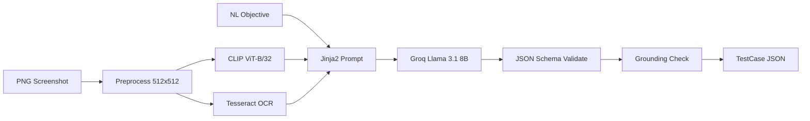

# SpecSnap

**Multimodal AI for Automated Test Case Generation from UI Screenshots and Natural Language**

B.Tech AIML · Multimodal AI Mini Project · Group 32 · SIT Pune  
Team: Sehajdeep Singh Sikka, Shwet Gaur · Guide: Prof. Nivedita Mishra · SDG 9

SpecSnap is a **standalone** project. It generates structured JSON test steps from screenshots + NL. It does not depend on [DS-1 agentic-webapp-test-executor](https://github.com/).

## Architecture



## Quick Start

### 1. Setup

```bash
cd specsnap
python -m venv .venv
.venv\Scripts\activate          # Windows
pip install -r requirements.txt
playwright install chromium     # for screenshot capture + demo
cp .env.example .env            # add GROQ_API_KEY
```

**Tesseract:** Install [Tesseract 5.x](https://github.com/tesseract-ocr/tesseract) and optionally set `TESSERACT_CMD` in `.env`.

### 2. Sauce Demo End-to-End

```bash
python scripts/capture_saucedemo.py   # 1280x720 login screenshot
python scripts/e2e_saucedemo.py       # pipeline → results/saucedemo_generated.json
python scripts/demo_playwright.py     # optional: execute generated steps
```

### 3. Web UI + API

```bash
uvicorn src.api.main:app --reload --host 0.0.0.0 --port 8000
```

Open http://localhost:8000 — upload PNG, enter objective/expected outcome, generate & download JSON.

| Endpoint | Method | Description |
|----------|--------|-------------|
| `/health` | GET | Health check |
| `/api/v1/generate` | POST | `image` + `objective` + `expected_outcome` → TestCase JSON |

### 4. Tests & Eval

```bash
pytest tests/unit -v
python scripts/build_manifest.py
python scripts/run_eval.py
```

## Repository Layout

```
specsnap/
├── data/           manifest, splits, manual_web, embeddings, test_holdout
├── schemas/        JSON Schema + Pydantic models
├── src/
│   ├── preprocess/ vision/ ocr/ llm/ validate/
│   ├── pipeline/   SpecSnapPipeline.generate()
│   ├── dataset/    manifest + Rico filters
│   ├── eval/       baselines + metrics
│   └── api/        FastAPI app
├── frontend/       upload UI
├── scripts/        capture, e2e, eval, demo
├── notebooks/      EDA
└── tests/unit/
```

## Output Schema

Allowed actions: `click`, `fill`, `select`, `assert_text`, `assert_url`, `goto`  
Schema: `schemas/test_case_output.v1.json`

## Definition of Done Checklist

- [x] Repo scaffold + core pipeline
- [x] Sauce Demo screenshot E2E path
- [x] JSON schema + Pydantic + grounding validator
- [x] FastAPI + upload UI
- [x] Baseline eval scripts + unit tests
- [ ] 850-record manifest (Rico/MobilityUI/synthetic pipelines)
- [ ] CLIP embedding cache at scale
- [ ] Baseline C ≥90% on validation
- [ ] Sealed test hold-out F1 ≥0.80
- [ ] EDA notebook with figures
- [ ] Expanded manual web corpus (150 pairs, CA-3)

## License

Academic project — SIT Pune, 2026.
